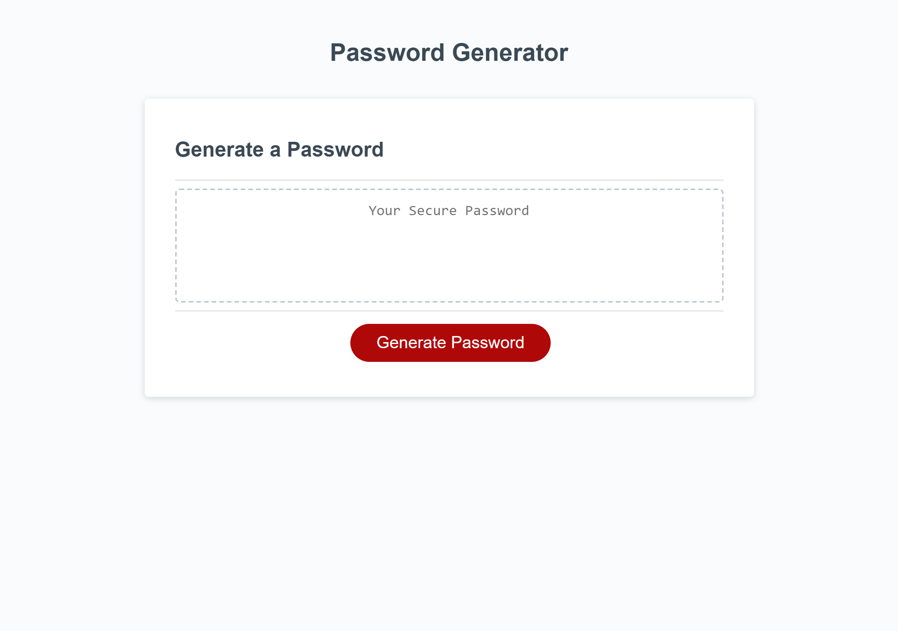

# Password Generator

This [webpage](https://amikerb.github.io/Password-Generator/) uses JavaScript to alllow the user to generate a random password. When the 'Generate Password' button is clicked, a prompt pops up asking the user how long they would like their passsword to be, if they'd like both lowercase and uppercase characters, if they'd like  numbers and if they'd like special characters included in their password. Based on the users input a random password is generated into the box.

## Usage 

### Screenshot of wepage on a desktop:

## Credits 

- [starter code](https://github.com/skills-bootcamp/frontend-dev/tree/main/week5/day4/my-work) provided 
- stackoverflow forum for [Javascript user input password generator](https://stackoverflow.com/questions/61239900/javascript-user-input-password-generator) 
- mdn web docs for [.charAT() method](https://developer.mozilla.org/en-US/docs/Web/JavaScript/Reference/Global_Objects/String/charAt) 
- mdn web docs for [.join() method](https://developer.mozilla.org/en-US/docs/Web/JavaScript/Reference/Global_Objects/Array/join) 
- mdn web docs for [Math.random() method](https://developer.mozilla.org/en-US/docs/Web/JavaScript/Reference/Global_Objects/Math/random) 
- youtube channel from Inside code for [How to shuffle an array (Fisher-Yates algorithm) - inside code](https://www.youtube.com/watch?v=4zx5bM2OcvA)
- [Fisher-Yates Shuffle](https://bost.ocks.org/mike/shuffle/)